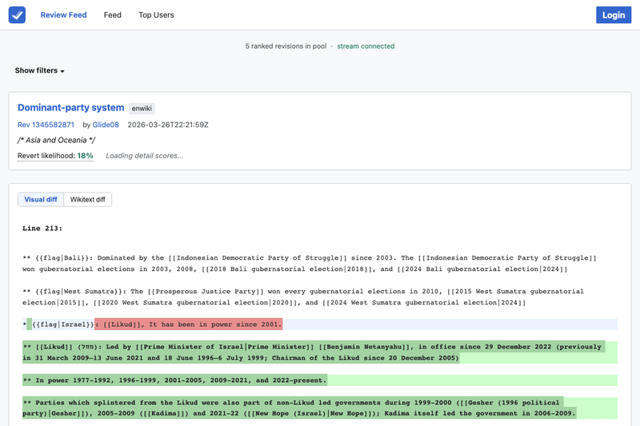

# WikiLoop DoubleCheck

> **v5 is live!** WikiLoop DoubleCheck has been rebuilt from the ground up with a modern TypeScript/Vue 3 stack, native Wikipedia integration via UserScript, and real-time Wikimedia EventStreams feed. Active deployment resumed March 2026.

Community tool for reviewing Wikipedia edits using AI-assisted scoring and human judgement. Available as a **web app**, **Wikipedia userscript**, and **Chrome extension**.

WikiLoop DoubleCheck was originally developed at Google (as `google/wikiloop-doublecheck`). Since the author left Google, the project has moved to **[github.com/wikiloop](https://github.com/wikiloop)** and is now maintained entirely through community contributions. **Help wanted and welcome** — whether you're a developer, Wikipedia editor, or researcher, we'd love your involvement.

**[Start Reviewing](https://doublecheck.wikiloop.org/review)** | **[Install UserScript](https://en.wikipedia.org/wiki/Wikipedia:WikiLoop_DoubleCheck)** | **[Chrome Extension](https://chromewebstore.google.com/detail/wikiloop-doublecheck/efpakmfbfkbeoejabnbamnmpbmncippn)** | **[Wikipedia Project Page](https://en.wikipedia.org/wiki/Wikipedia:WikiLoop_DoubleCheck)** | **[Discord](https://discord.gg/daZXxPB)**

<!-- TODO: Add review flow GIF here -->
<!--  -->

## What's New in v5

- **Native Wikipedia UserScript** — runs directly on every Wikipedia page with a "DoubleCheck" tab (like Twinkle). Uses MediaWiki's built-in Vue 3 + Codex from ResourceLoader (zero extra download).
- **Real-time review feed** — live stream from Wikimedia EventStreams with AI-ranked priority scoring. Reviews edits most likely to be damaging first.
- **Direct revert/warn/thank** — actions use your own Wikipedia session via the MediaWiki API. Reverts appear under your account.
- **Article history mode** — on article history pages, review the last 5 revisions of that article before switching to the global feed.
- **Cross-wiki support** — install once from Meta-Wiki, works on all Wikimedia wikis (English, French, Japanese, etc.).
- **Shared component architecture** — web app, userscript, and extension all share UI components from `@doublecheck/core`.

## Install

### UserScript (recommended)

Visit **[Wikipedia:WikiLoop DoubleCheck](https://en.wikipedia.org/wiki/Wikipedia:WikiLoop_DoubleCheck)** and click **"Install DoubleCheck"**. One click — done.

The userscript adds a "DoubleCheck" tab to every Wikipedia page. Click it to open the review modal with the full review interface, diff viewer, ML risk scores, and action buttons — without leaving the page.

### Chrome Extension

Install from the **[Chrome Web Store](https://chromewebstore.google.com/detail/wikiloop-doublecheck/efpakmfbfkbeoejabnbamnmpbmncippn)**.

### Web Application

Visit **[doublecheck.wikiloop.org/review](https://doublecheck.wikiloop.org/review)** — no installation needed.

## Features

- **Review interface** — Full diff viewer with ML risk scores (LiftWing/ORES damaging and good-faith probabilities)
- **Judgement actions** — Mark revisions as "Should Revert", "Not Sure", or "Looks Good"
- **Direct revert** — Undo edits using your Wikipedia session (vandalism or good-faith revert modes)
- **Warn user** — Post warning templates (levels 1-4 and 4im) to the editor's talk page
- **Thank author** — Send MW thanks notifications for good edits
- **Risk badges** — Colored risk indicators on Special:RecentChanges and Special:Watchlist
- **Real-time feed** — Live stream from Wikimedia EventStreams, ranked by human-review priority
- **Keyboard shortcuts** — R (revert), G (looks good), N (not sure + skip), Arrow keys (prev/next)
- **Leaderboard** — [doublecheck.wikiloop.org/leaderboard](https://doublecheck.wikiloop.org/leaderboard)

## How It Works

1. A "**DoubleCheck**" tab appears on every Wikipedia page
2. Click it to open the review modal — edits stream in from Wikimedia EventStreams, ranked by AI risk score
3. Review the diff, see ML scores, and judge: **Should Revert**, **Not Sure**, or **Looks Good**
4. If vandalism: **directly revert** with one click (uses your Wikipedia account)
5. After reverting: **warn the editor** with standard warning templates
6. If good edit: **thank the author** via MW Thanks

## Architecture

```
@doublecheck/core        Shared Vue 3 components, composables, API client, types
@doublecheck/web         Web SPA (Vite + Vue 3 + Codex) → Vercel + Toolforge
@doublecheck/server      Express API + MongoDB → Toolforge
@doublecheck/userscript  Wikipedia UserScript (Vue via ResourceLoader) → Toolforge
@doublecheck/extension   Chrome Extension (Manifest V3) → Chrome Web Store
```

- **Frontend:** TypeScript, Vue 3, Wikimedia Codex UI
- **Backend:** Node.js, Hono, MongoDB
- **ML Scoring:** Wikimedia LiftWing (ORES) + revert-risk prediction via EventStreams
- **Hosted on:** [Toolforge](https://wikiloop-doublecheck.toolforge.org) and [Vercel](https://doublecheck.wikiloop.org)

## Development

```bash
pnpm install
pnpm build
pnpm test           # 180+ tests across all packages
pnpm dev            # start dev servers
```

## Deploy

```bash
bash scripts/deploy.sh all          # deploy to all targets
bash scripts/deploy.sh vercel       # web app → Vercel
bash scripts/deploy.sh toolforge    # server + userscript → Toolforge
bash scripts/deploy.sh extension    # Chrome extension → CWS
```

## Contributing

See **[Wikipedia:WikiLoop DoubleCheck](https://en.wikipedia.org/wiki/Wikipedia:WikiLoop_DoubleCheck)** for the contributor signup. Issues and PRs welcome on [GitHub](https://github.com/wikiloop/doublecheck/issues).

## License

[Apache-2.0](LICENSE)
